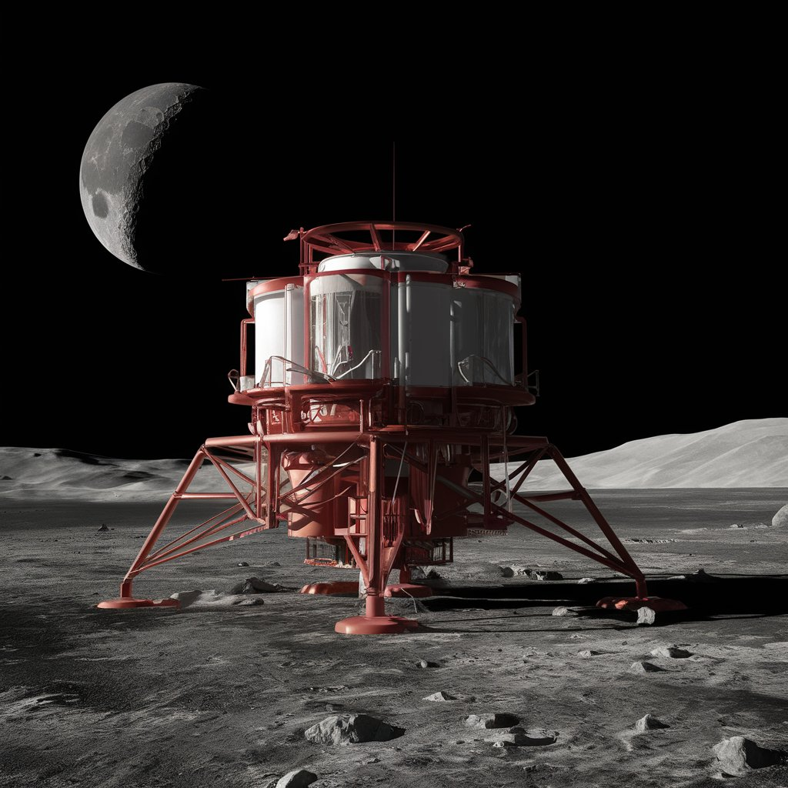
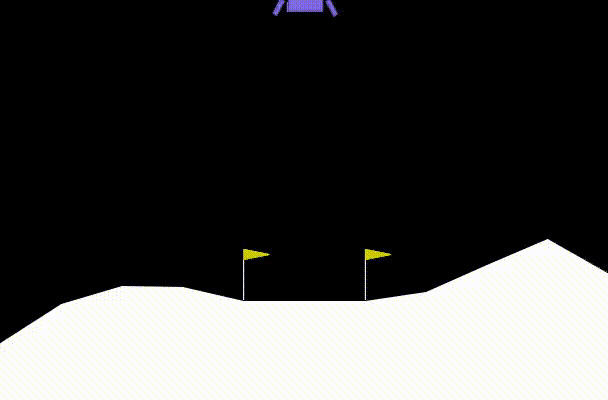
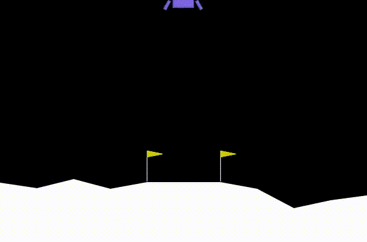
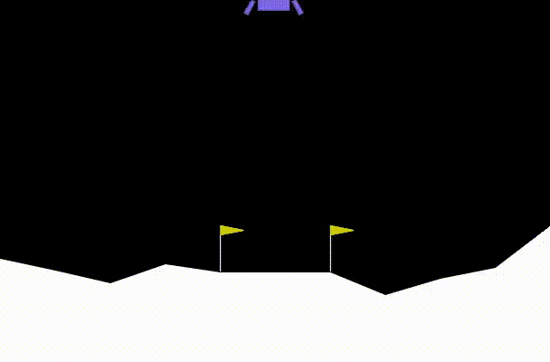

  
  

<h1 align="center">LunarLander-DQN-Comparison</h1>

Este repositorio contiene soluciones para el environment de Lunar Lander utilizando tres variantes de Deep Q-Networks (DQN):

- DQN (Deep Q-Network)
- Double DQN
- Dueling DQN

  <a href="https://drive.google.com/drive/folders/1-Tbos5aCdj8Qgy_Rz5d8T8tbtm-42TiF?usp=sharing" style="display: flex; align-items: center;">
    
    [Enlace al repositorio en Google Drive]
  </a>
     :  Desde ahí se puede acceder a todo el repositorio para ejecutar directamente desde Google Colab.

### Abrir en Google Colab

O ejecutar los notebooks directamente en Google Colab, puedes utilizar los siguientes botones:

- **DQN (Deep Q-Network)** ->
  )

- **Double DQN** ->
  

- **Dueling DQN** ->
  

  
## Descripción del Proyecto

El objetivo de este proyecto es comparar el desempeño de tres técnicas avanzadas de aprendizaje por refuerzo profundo en la tarea de aterrizaje lunar. Los resultados se presentan mediante implementaciones detalladas, scripts de entrenamiento y evaluación, y vídeos demostrativos.

## Resultados

A continuación se presentan vídeos demostrativos de la resolución del problema con cada uno de los agentes:

### DQN (Deep Q-Network)

### Double DQN

### Dueling DQN

## Estructura del repositorio
 <pre>
├── Deep_Q_Learning_for_Lunar_Landing.ipynb # Implementación y explicación del algoritmo DQN
├── Double_DQN_for_Lunar_Landing.ipynb # Implementación y explicación del algoritmo Double DQN
├── Dueling_DQN_for_Lunar_Landing.ipynb # Implementación y explicación del algoritmo Dueling DQN.
├── LunarLander_DQN_Conclusion.docx # Archivo en el que se documenta el proyecto y las conclusiones obtenidas
├── videos # Carpeta con los videos demostrativos
│ ├── DQN_result.mp4
│ ├── Double_DQN_result.mp4
│ └── Dueling_DQN_result.mp4
└── README.md # Este archivo README
  </pre>

<h2>Contribución</h2>

  
Si deseas contribuir o preguntar cualquier duda sobre este proyecto, ¡Contacta por LinkedIn! Y siéntete libre de crear pull requests con tus contribuciones.

  <h2>Créditos</h2>

  
Este proyecto ha sido desarrollado por <a href="#"> Vicent Muñoz Correcher </a>.

<h2> Contacto </h2>
Para cualquier consulta, puedes contactarme a través de mi perfil de GitHub.
